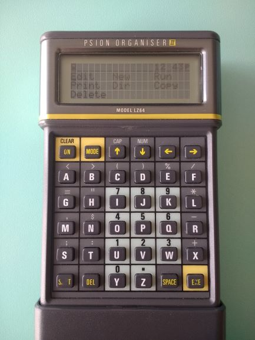
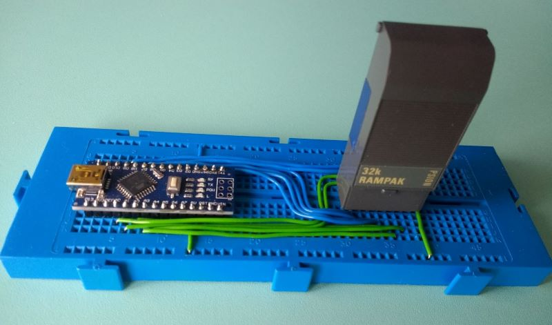
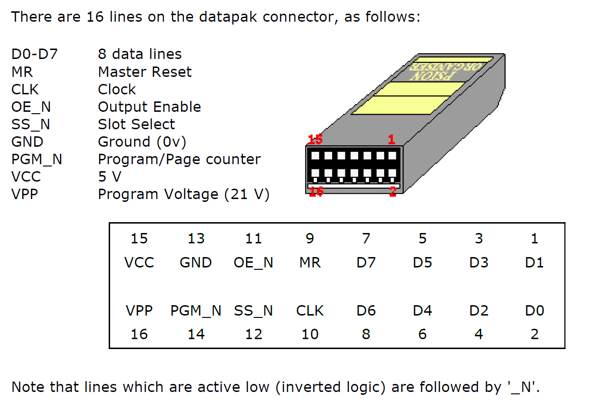

# Psion2-Datapak-Rampak-reader-writer

The Psion Organiser II is a handheld 8-bit micro from the 1980s, it was sold to the public as a personal digital assistant (PDA) and was widely used in industry, over 1/2 million were made. The PDA models have a diary, can store information and can be programmed to perform calculations and manipulate data, there are even some simple games for it. Its PDA functions have since been replaced by the smartphone, so alot of these Psions eventually found their way into the back of a drawer somewhere. However, these devices are as tough as a brick, so if you find one and put a fresh 9 V battery in, it's very likely to work. The same cannot be said of many devices that followed it. The Psion II was a ground-breaking device in its time, and it still has an active following of dedicated users. 

 Lots of info about the Psion II can be found at the website by Jaap Scherphuis: [Jaap's Psion2 site](https://www.jaapsch.net/psion/index.htm)

I used an Arduino to read and write to a Psion II Rampak, these packs contain a memory chip, two counters and some logic. The packs require a 5 V supply, so are well suited to an Arduino Nano which also uses 5 V, powered from USB.

- Uses linear or paged addressing, larger segmented packs are not supported.
- Datapaks can be read from but not written to (because these packs contain EPROMs which require UV light to erase them and a 21 V supply to write).
- Pack image files for read/write use the standard OPK format of the Psion Developer software, for more info see [Martin Reid's Developer manual](https://sites.google.com/site/martin2reid/psion-organiser-ii/manuals/developer?authuser=0).

Psion Organiser II pack images can be created, viewed or edited using [Jaap's OPK editor](https://www.jaapsch.net/psion/opkedit.htm).

I wrote software for the Arduino and PC. The PC software (in Python), allows pack images to be transferred between the PC and the Rampak, via the Arduino USB serial port.

The circuitry is very simple, just connecting of I/O lines to the datapak, I made a datapak connector which is just a 2x8 pin header, with stripboard to widen the connections to fit either side of the centre of a breadboard.

Be careful if you modify the software as it is possible to damage a datapak/rampak or the Arduino if both set the data pins to output at the same time.
Also, make sure you connect the pack the correct way around (see pinout below, also if you unclip the cover of the rampak/datapak some of these packs have pin 1 indicated by a red triangle) and only insert or remove a pack when prompted by the software. Be aware that you use this software and information at your own risk.

The software presents the user with a simple text menu of options: 
"Select a command: e-erase, r-read pack, w-write pack, 0-print page 0, 1-print page 1, m-write test record to main or press x to exit" 
Sending a single character via the serial link will select the command.
Some of these commands can be used via the Arduino serial monitor, or similar terminal, but the read and write commands expect the data to be echoed back to verify it and control data flow, this is coded into the software. Filenames for transfer are entered directly into the Python code before it is run using the infile and outfile variables near the top of the program listing.

**Description of the the commands:**
- e - erases the first 2 pages, i.e. the first 512 bytes of the pack, by setting all bits high. (full rampak formatting is best done using the Organiser in the normal way)
- r - reads data from the pack to the outfile on the PC. Reads until a certain number of 0xFF bytes are read (currently 3) to signify that the end of the pack has been reached.
- w - writes data from the PC infile to the pack. Modifies the pack ID bytes (to set as a rampack or adjust pack size) if certain flags are set in the Python program.
- 0 - prints the contents of the first 256 bytes of the pack as a hex dump with ascii characters, the zero page, addresses 0x0 to 0xFF.
- 1 - prints the contents of the second 256 bytes of the pack as a hex dump with ascii characters, addresses 0x100 to 0x1FF.
- m - adds a test record with the text "TEST DATA" to the main data file.
- x - exits the menu and allows the pack to be removed.

# Components
- Arduino Nano or similar
- Header pins 2.54 mm pitch, 1x 2x8 pins and 2x 1x8 pins (used for datapak connector)
- Small piece of stripboard (used for datapak connector)
- Psion organiser II Datapak or Rampak - Datapak for read or Rampak for read/write
- Breadboard

# Photo of the Rampak reader-writer

# Schematic

# Datapak connector
This is made from headers soldered to stripboard to widen the connections for the breadboard, the centre line of the stripboard is cut to not short the connections.
The lower pins were pushed through the plastic to make them longer for soldering and the plastic was removed afterwards. 

# Datapak pinout

