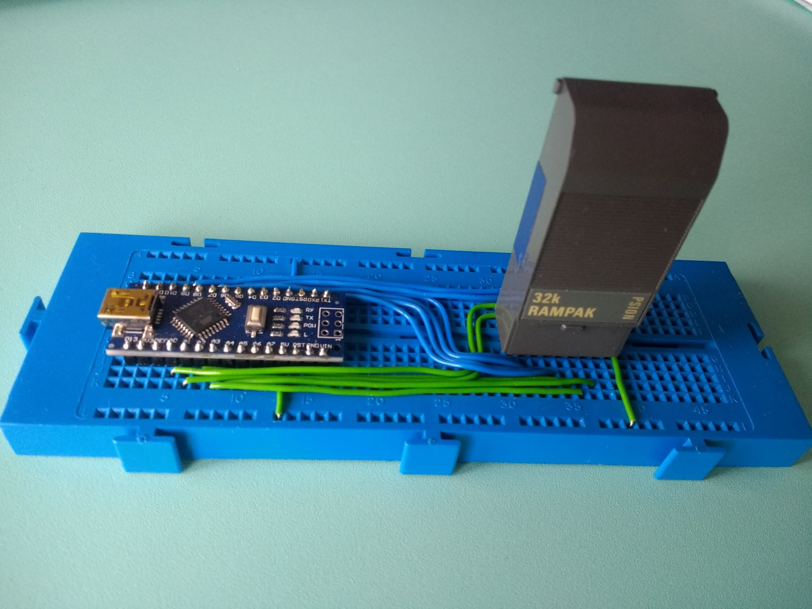
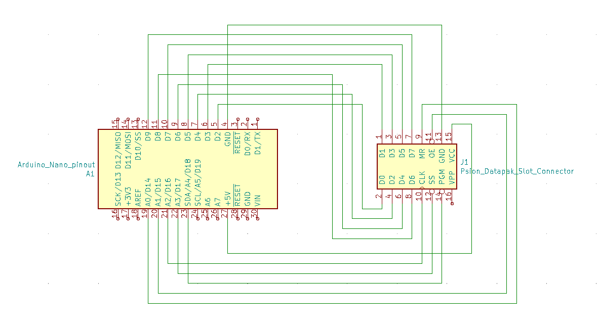

# Psion2-Datapak-Rampak-reader-writer
Arduino and Python code to transfer psion2 pack images between a PC and an Arduino

I used an Arduino to read and write to a Psion II Rampak, these packs contain a memory chip, two counters and some logic. The packs require a 5 V supply, so are well suited to an Arduino Nano which also uses 5 V, powered from USB.

Psion Organiser II pack images can be created and edited here: 
<a href="https://www.jaapsch.net/psion/opkedit.htm">

> Uses linear or paged addressing, larger segmented packs are not supported.
> Datapaks can be read from but not written to (because these packs contain EPROMs which require UV light to erase them and a 21 V supply to write).

I wrote software for the Arduino and PC. The PC software (in Python), allows pack images to be transferred between the PC and the Rampak, via the Arduino USB serial port.

The circuitry is very simple, just connecting of I/O lines to the datapak, I made a datapak connector which is just a 2x8 pin header, with stripboard to widen the connections to fit either side of the centre of a breadboard.

**Components** 
1× Arduino Nano or similar 
1× Header pins 2x8 pins 2.54 mm pitch - used for datapak connector 
1x small piece of stripboard - used for datapak connector 
1× Psion organiser II Datapak or Rampak - Datapak for read or Rampak for read/write 
1× Breadboard 

**Photo of the Rampak reader-writer** 

**Schematic** 

**datapak connector** 
This is made from headers soldered to stripboard to widen the connections for the breadboard, the centre line of the stripboard is cut to not short the connections 
The lower pins were pushed deeper through the plastic to make them longer 

